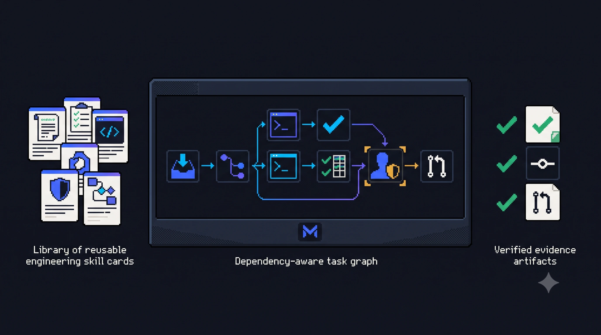
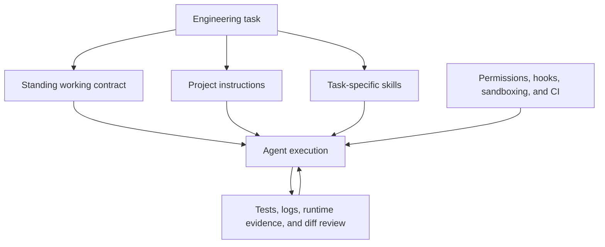

# Mivia Agent Skills

Open skills, engineering contracts, doctrines, and practical guidance for reliable agentic software delivery.

Read the [documentation site](https://mivialabs.github.io/mivia-agent-skills/) for a navigable HTML version of every Markdown file in this repository.



## About

I’m [Mac Lisowski](https://mivialabs.com/#about), founder and principal AI engineer at [MiviaLabs](https://mivialabs.com/). I build [MIVIA](https://mivia.app/), a governed AI engineering system, and publish the reusable skills, contracts, and workflows that support that work here.

This repository captures patterns developed through hands-on work with coding agents across planning, implementation, debugging, verification, review, and delivery.

The goal is not to publish another prompt collection. The goal is to turn repeatable engineering judgment into reusable assets that people can install, inspect, test, and adapt.

## Install into a target repository

The filesystem installer is the integrated project bootstrap. It installs the
standing contract, supporting doctrines, platform instruction adapters, and
skills as one managed runtime. It does not copy articles, documentation,
examples, or maintainer tooling into the target repository.

From this checkout, run:

```bash
python3 scripts/install.py --scope project --target both --project /path/to/repository
```

The target receives `AGENTS.md`, `CLAUDE.md`, `.mivia-agent-skills/`,
`.agents/skills/`, and `.claude/skills/`. Existing instruction content remains
outside the managed block. Fill in repository-specific commands and rules in
the target files; the starter templates are in [`examples/project`](examples/project).

To update the managed runtime, pull this repository and rerun the same command.
To remove it, add `--uninstall`.

Use `python` or `py` on Windows when `python3` is unavailable.

## Other distribution paths

### Codex Desktop

Add this repository as a plugin marketplace:

```bash
codex plugin marketplace add MiviaLabs/mivia-agent-skills
```

Restart the ChatGPT desktop app, open **Plugins** from Codex, select **Mivia Agent Skills**, and install **Mivia Agentic Engineering**.

### Claude Code

Run:

```text
/plugin marketplace add MiviaLabs/mivia-agent-skills
/plugin install mivia-agentic-engineering@mivia-agent-skills
```

Start a new session or run `/reload-plugins`.

### Claude Desktop and Cowork

Tagged releases attach one upload-ready ZIP per skill. Download the ZIP files you need, then open **Customize > Skills**, choose **Create skill**, and upload them separately.

Before the first release, build the ZIP files locally:

```bash
python3 scripts/package_claude_skills.py --output dist
```

### Global or project-level contract

Install the engineering working contract and skills into Codex and Claude Code:

```bash
python3 scripts/install.py --scope global --target both
```

For one repository only:

```bash
python3 scripts/install.py --scope project --target both --project /path/to/repository
```

The installer preserves existing instruction content, creates backups before
changed managed content, rejects unmarked skill collisions, and removes only
files it manages.

See [Installation and usage](docs/installation.md) for setup, updates, removal, verification, and platform limits.

## What is included

- [`skills/engineering-working-contract`](skills/engineering-working-contract/SKILL.md) - applies the operating contract to software engineering work
- [`skills/verify-code-change`](skills/verify-code-change/SKILL.md) - verifies code changes according to risk and blast radius
- [`skills/deep-bug-audit`](skills/deep-bug-audit/SKILL.md) - audits cross-boundary behavior for source-grounded bugs and regression gaps
- [`skills/mivia-image-generation`](skills/mivia-image-generation/SKILL.md) - generates repository images in the established Mivia visual style
- [`contracts/engineering-agent-working-contract.md`](contracts/engineering-agent-working-contract.md) - the canonical standing contract
- [`doctrines/`](doctrines/) - durable principles behind the contract
- [`articles/`](articles/) - practical explanations based on real agentic coding work
- [`docs/`](docs/) - installation, architecture, limits, and design review
- [`examples/`](examples/) - project-level Codex and Claude Code templates

## What's coming

The next articles will stay practical:

1. **CI/CD and hook enforcement** - pre-commit and pre-push enforcement with examples that are easy to adopt.
2. **Prompt evaluations and grading** - complete tooling so users can run evaluations and grading without assembling the workflow themselves.
3. **DAG decomposition for agent tasks** - a skill and article on breaking work into dependency-aware tasks and enforcing that graph in a local agentic workflow.
4. **Codebase grading** - a follow-up to prompt evaluations: a workflow and article for grading agent work against the repository's actual contracts, tests, and behavior.

See the [article index](articles/README.md) for the current table of contents and roadmap.

## How the pieces fit together



The contract shapes judgment across engineering tasks. Project instructions provide repository-specific commands and constraints. Skills provide procedures that should load only when relevant. Hard controls enforce boundaries that should not depend on model memory.

## Design principles

- Evidence before claims
- Smallest complete change
- Root cause analysis before redesign
- Risk-based autonomy
- Verification before completion claims
- Independent review for consequential work
- Short standing instructions and focused procedural skills
- Hard controls for hard boundaries

## Important limits

These assets are designed to improve workflow discipline. They do not guarantee correct code, secure systems, complete tests, or sound product decisions.

A skill is still executable instruction supplied to an agent. Review third-party skills before enabling them, especially when they include scripts, hooks, broad permissions, or external tools.

See [Design review and known gaps](docs/design-review.md) for the claims that were challenged and the limitations that remain.

## Validate the repository

Configure the local hooks once per checkout. They run the same repository
checks as CI before commits and add the full documentation build before pushes:

```bash
python3 scripts/install_hooks.py
python3 -m venv .venv
.venv/bin/python -m pip install --requirement requirements/docs.txt
```

Then run the core checks directly when needed:

```bash
python3 tooling/validate_repository.py
python3 tooling/test_deep_bug_audit.py
python3 tooling/test_distribution.py
```

On Windows, use `python` or `py` if `python3` is not available.

Validation covers skill structure, evaluation cases, links, manifests, contract synchronization, Python syntax, prohibited branch-status language, em dashes, safe installation, removal, and Claude ZIP structure.

## License

MIT
