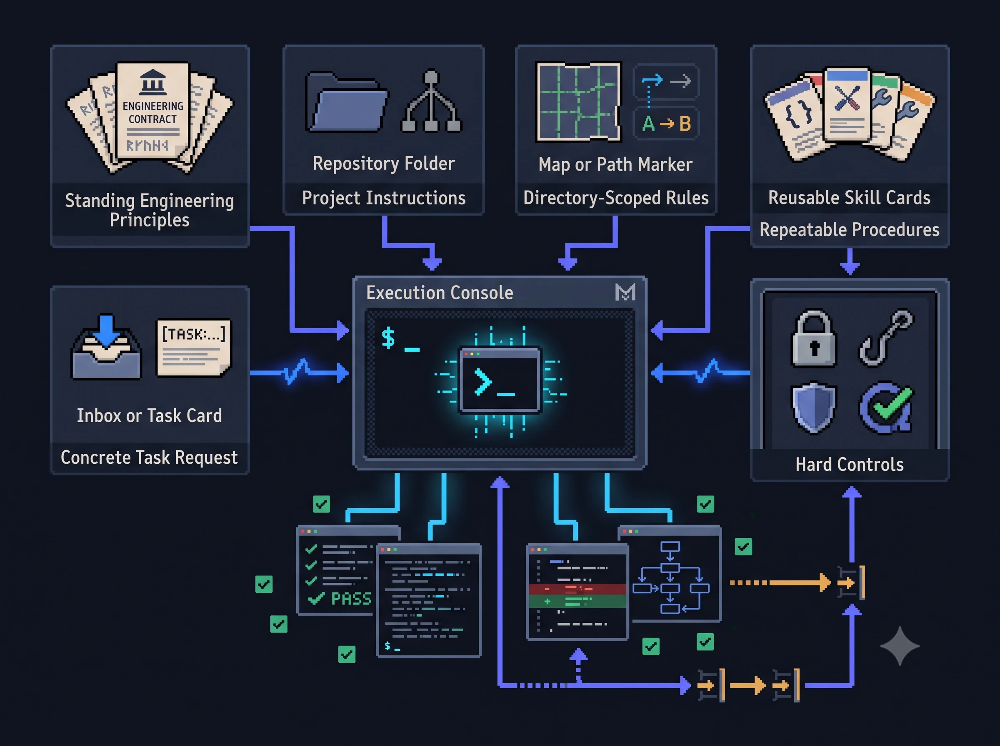
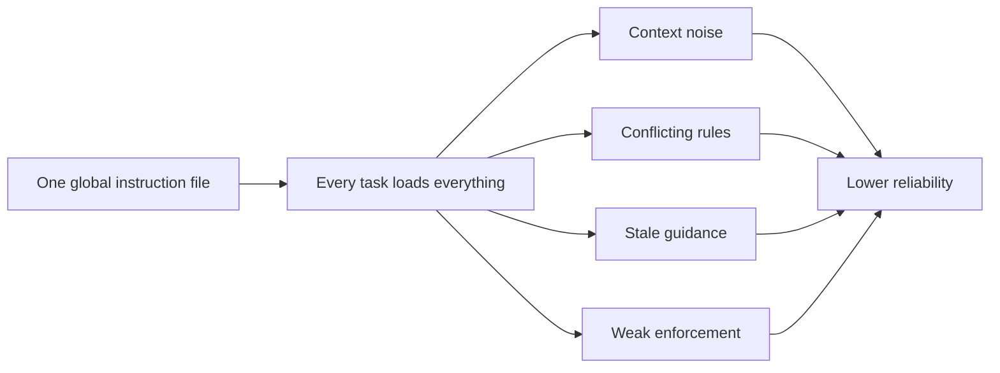
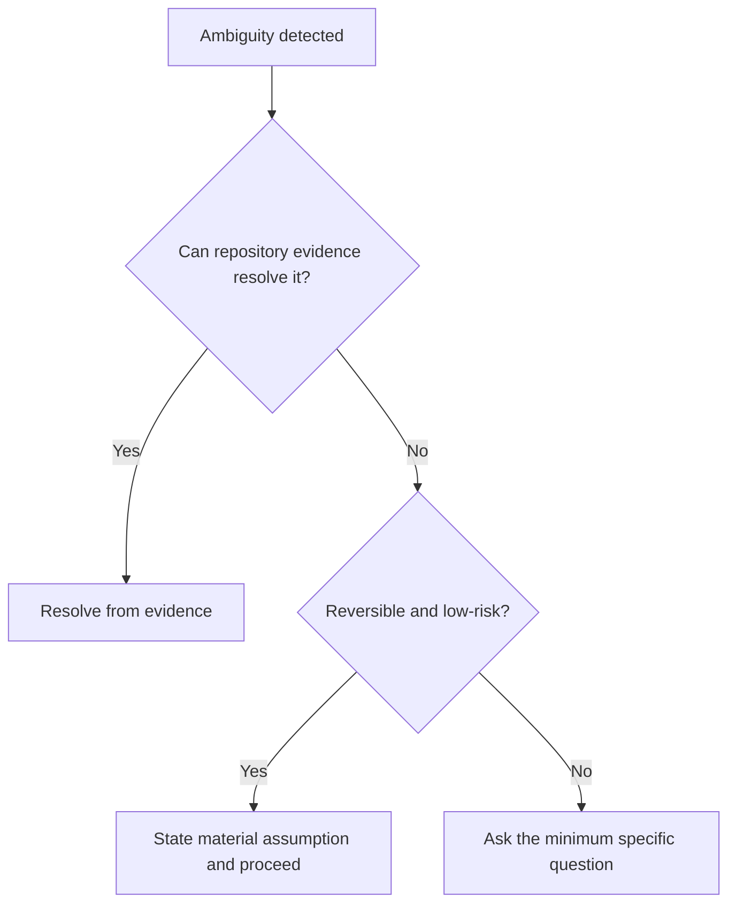
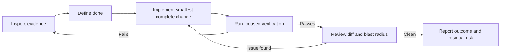
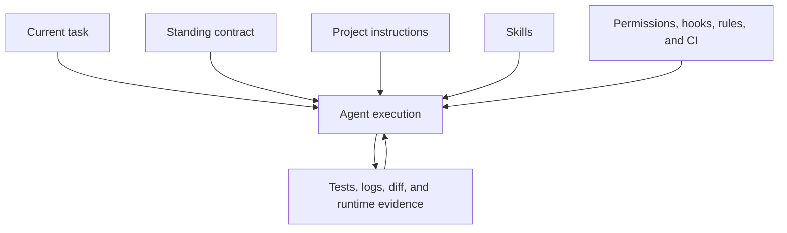

# Coding Agents Need an Engineering Working Contract

Most failures I see in agentic coding are not model intelligence failures. They are workflow failures.

The agent can inspect code, generate a patch, run commands, and explain the result. Problems usually happen around that work. It assumes too much. It asks unnecessary questions. It patches the symptom instead of the cause. It introduces abstractions nobody asked for. It reports checks it did not run. Or it produces so much narration that the actual result becomes hard to review.

After working with coding agents across planning, implementation, debugging, verification, review, and delivery, I have found that better prompts alone are not enough. Agents need a clear engineering working contract.

A working contract defines how the agent should operate:

- what evidence it should trust;
- when it should proceed autonomously;
- when it must ask;
- how it should choose an implementation;
- what verification is required;
- what must be reported before the task is considered complete.

This is not a claim that instructions can make an agent reliable by themselves. A contract does not repair weak requirements, missing test environments, unsafe permissions, or bad architecture. It reduces a specific class of avoidable workflow failures.

## Challenge the idea first

The obvious response is to put every useful rule into one large global instruction file.

That is usually the wrong implementation.

A large global file mixes communication preferences, engineering principles, repository conventions, workflow procedures, review criteria, and safety controls. Those rules do not share the same scope. Loading all of them into every task creates noise, increases contradictions, and makes old guidance harder to detect.

The answer is not fewer standards. The answer is better separation.

The global contract should contain principles that change agent judgment across most engineering tasks. Repository instructions should contain local architecture and commands. Skills should contain repeatable procedures. Permissions, hooks, sandboxing, and CI should enforce hard boundaries.

## What belongs in the contract

### Evidence before claims

Coding agents can produce confident explanations of APIs that do not exist, tests they did not run, and architectures the repository does not use.

One rigid evidence hierarchy is not enough. Engineering work asks two different questions.

**What should happen?**

Use explicit constraints, accepted requirements, approved decisions, specifications, and project contracts.

**What currently happens?**

Use runtime behavior, tests, logs, code, configuration, and version history.

Tests, documentation, and code can disagree. None is automatically correct. The agent should reconcile contradictions instead of selecting the source that supports its first conclusion.

The agent may infer. It must not present inference as verification.

### Risk-based autonomy

"Ask when anything is unclear" sounds safe. In practice, it creates a hesitant agent that stops on routine ambiguity.

A better rule is simple:

- proceed when the assumption is local, reversible, and low-risk;
- ask when the missing information affects public behavior, architecture, security, privacy, migrations, destructive actions, significant cost, or deployment impact.

This avoids both extremes: reckless autonomy and constant interruption.

### Root cause without speculative redesign

Agentic coding often fails in two opposite ways.

The first is superficial patching. The visible error disappears, but the underlying invariant remains broken.

The second is speculative redesign. The agent introduces a framework, dependency, or abstraction for a problem that needed a focused fix.

The working contract should require both:

- understand the failure or invariant before choosing the fix;
- prefer the smallest change that fully satisfies the requirement.

This is not absolute. An incident may require containment before the complete root cause is known. In that case, the agent should identify the mitigation as temporary and state what remains unresolved.

"Always centralize" and "never duplicate" also sound disciplined, but they often produce unnecessary coupling. Shared rules and invariants should be centralized when they genuinely evolve together. Incidental similarity should remain local.

### Verification as part of delivery

A patch is not finished because it looks plausible.

The agent should start with the smallest relevant check, then expand verification according to blast radius and risk. For a bug, that normally means reproducing the failure, applying the fix, rerunning the reproduction, and executing the nearest relevant tests or static checks.

Verification reduces uncertainty. It does not prove the absence of defects. A `PASS` result must describe the executed scope, not imply universal correctness.

This changes the role of the agent. It is no longer only generating code. It is executing an engineering workflow.

### Independent judgment

An agent should not act as a confidence amplifier for the person using it.

It should challenge user assumptions when evidence warrants it. It should sanity-check estimates rather than anchor on them. It should not change a conclusion because the user pushes back. It should update when the evidence or constraints change.

This needs restraint. Leading with a counterargument is useful when it changes the decision. Applying it mechanically to every statement creates friction without improving the work.

### Constrained communication

Agent narration can become its own failure mode.

A useful progress update communicates one of five things:

- a material discovery;
- a decision;
- a changed approach;
- a blocker;
- a completed milestone.

The final response usually needs only the outcome, changed files, verification, and remaining risk.

Terseness must not hide uncertainty. The goal is to compress evidence, not remove it.

## Instructions are not enforcement

A sentence in a Markdown file is guidance. It is not a hard control.

"Run the relevant tests" belongs in an instruction because the correct tests depend on context.

"Never execute this destructive command without approval" should not depend only on the model remembering a sentence. That belongs in permissions, hooks, command rules, sandboxing, or CI.

## The layered operating model

| Layer | Purpose |
|---|---|
| Standing contract | Communication, evidence discipline, autonomy, implementation principles, and verification expectations |
| Project instructions | Architecture, commands, conventions, dependency policy, and definition of done |
| Path-scoped rules | Local requirements for a service, language, directory, or high-risk component |
| Skills | Repeatable workflows such as reviews, migrations, releases, and investigations |
| Hard controls | Permissions, hooks, sandboxing, secret scanning, required checks, and CI |
| Task request | Concrete outcome, constraints, source material, and acceptance criteria |

The global layer should remain a constitution, not a handbook.

## How to use it

There are three practical deployment modes.

### Global

Install the compact working contract as persistent instructions. Install reusable skills into the user's global skill directories.

Use this when the same engineering expectations should apply across repositories.

### Repository

Check project-specific `AGENTS.md` and `CLAUDE.md` files into the repository. Add architecture, commands, constraints, and the local definition of done.

Use this when teams need consistent behavior inside one codebase.

### Desktop plugin or uploaded skill

Install the skill bundle in Codex Desktop, Claude Code, or Claude Desktop. Skills load only when the task matches their scope.

Use this for portable workflows. Do not expect a desktop skill to know repository-specific facts that were never provided.

## Why this works

Vague instructions such as "be senior," "think carefully," or "make it production-ready" are not verifiable.

A working contract defines observable behavior:

- inspect before changing;
- separate intended behavior from current behavior;
- distinguish facts from assumptions;
- challenge weak premises;
- avoid speculative abstraction;
- implement the smallest complete change;
- verify actual behavior;
- report only what happened;
- expose what remains uncertain.

That makes agent work more reviewable.

It also creates a cleaner division of responsibility. The human defines the outcome, constraints, consequential product decisions, and required approvals. The agent owns investigation, implementation, verification, and concise reporting within those boundaries.

The goal is not to personalize a chatbot.

The goal is to engineer a more reliable delivery workflow around coding agents.
