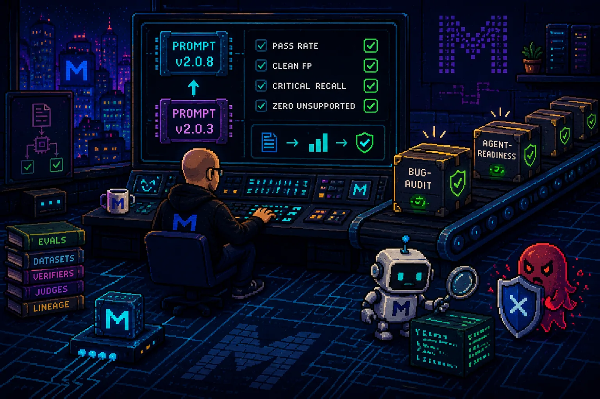
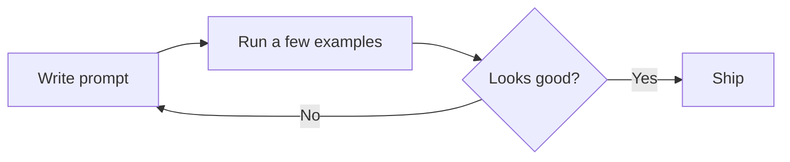
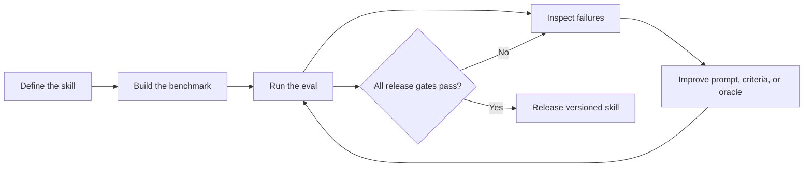
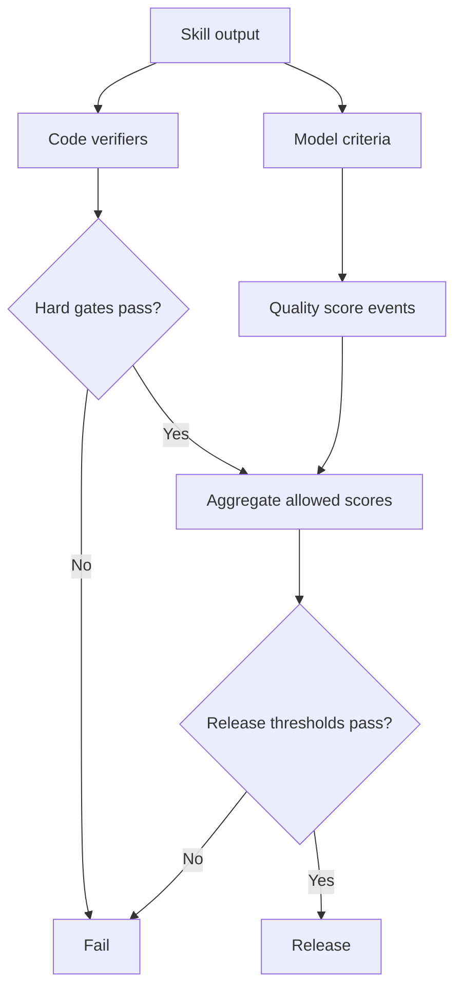

# How I Work with Evals and Prepare Skills at Mivia

*I stopped trusting prompts that looked good. I started building engineering skills that have to prove they improved.*

I have worked with enough coding agents to know that a good demo proves almost nothing.

A prompt can look excellent on one repository, one model, one carefully selected example. Then it reaches a slightly different codebase and starts inventing bugs, missing critical paths, or producing confident explanations that are not supported by the code.

That is why I do not treat prompts as finished assets at Mivia.

I treat them as one part of an engineering skill.

The skill is versioned. The benchmark is versioned. The scoring rules are explicit. Every release has gates. Every useful failure becomes a test that future versions must continue to pass.

This is how I prepare skills now.

## I do not optimize for the first impressive result

The usual prompt loop is simple:

That loop is fast. It is also easy to fool.

The model may have seen a familiar pattern. The selected examples may all be positive cases. The judge may reward confident writing. A prompt may improve one failure mode while quietly making another one worse.

I use a different loop:

The important change is not the use of an evaluation tool.

It is the decision that the benchmark, not my opinion, controls the release.

## A skill is more than a prompt

When I say "skill," I mean a complete reusable engineering capability.

Depending on the task, that can include:

- the main instructions;
- operating rules and stop conditions;
- references the agent should load only when needed;
- expected output contracts;
- examples of correct and incorrect behavior;
- code-based verifiers;
- model-based criteria;
- a regression dataset;
- release thresholds;
- reports and evidence from previous runs.

The prompt matters, but it is not the complete product.

A reliable skill also needs a clear answer to these questions:

1. What exactly is the agent expected to do?
2. What is it not allowed to claim without evidence?
3. What failures matter enough to block a release?
4. How do I detect regressions after changing the instructions?
5. Which cases were used during development, and which remain held out?

Without those boundaries, I only have a prompt that sometimes works.

## The Bug Audit skill forced me to make this real

The Bug Audit skill is a useful example because it is very easy to create a misleading demo.

Give an agent code with an obvious SQL injection or missing file close and it will usually produce an impressive answer.

That does not tell me whether the skill is reliable.

A useful bug auditor must do several things at once:

- detect reachable defects;
- explain the failure mechanism;
- cite evidence from the supplied code;
- calibrate severity;
- avoid reporting clean code as broken;
- avoid inventing security or tenant-isolation problems;
- understand language-specific semantics;
- remain useful across different frameworks and code shapes.

The false-positive requirement is especially important.

Finding *something suspicious* is easy. Finding a real defect without burying the engineer in noise is much harder.

## I built a benchmark that could break the skill

The current Bug Audit regression suite contains 100 cases across six languages:

| Language | Cases |
| --- | ---: |
| Python | 20 |
| Go | 19 |
| TypeScript | 18 |
| Java | 15 |
| C# | 14 |
| Rust | 14 |

The suite contains:

- 75 bug cases;
- 25 clean controls;
- 34 critical defects;
- train, development, and holdout splits;
- mechanism, lineage, and fingerprint metadata designed to reduce leakage.

The cases cover security, concurrency, persistence, resource cleanup, cancellation, cross-module contracts, framework semantics, authorization, configuration failures, and adversarial clean patterns.

I deliberately include code that looks suspicious but is correct.

Examples include proper `defer` cleanup in Go, context managers in Python, try-with-resources in Java, `using` in C#, escaped HTML in TypeScript, and correct `Result` handling in Rust.

Those cases are not filler. They test whether the skill understands the code or just reacts to keywords.

## I use release gates, not one blended score

A single average score can hide a serious weakness.

A skill can have strong overall recall while inventing security issues in clean tenant-scoped code. It can produce polished explanations while missing critical defects. It can improve its judge score while becoming less useful to engineers.

For Bug Audit, I use independent release gates:

| Gate | Threshold |
| --- | ---: |
| Aggregate pass rate | at least 90% |
| Clean false-positive rate | at most 3% |
| Critical-defect recall | at least 90% |
| Unsupported security or tenant findings | exactly 0 |

Every gate has to pass.

I do not average away a critical miss because the wording was otherwise good.

I also do not release a noisy auditor because it found most of the planted defects.

## The prompt passed, then I made the benchmark harder

The most useful part of the process is what happened after an apparently successful version.

The early paid campaign started with a 27-case suite. Versions `2.0.0` through `2.0.4` failed for different reasons: weak aggregate performance, too many clean false positives, missed critical cases, unsupported findings, or unstable severity calibration.

Version `2.0.5` finally passed the original suite with:

- 100% aggregate pass rate;
- 0% clean false positives;
- 100% critical recall;
- 0 unsupported security or tenant findings.

I could have stopped there and published a perfect-looking result.

Instead, I expanded the benchmark.

The suite grew from 27 to 55 cases, then to 100. New cases added more languages, stronger clean controls, multi-tenant traps, concurrency patterns, framework-specific behavior, and harder severity boundaries.

Previously passing behavior broke again.

That was the point.

A benchmark should not exist to protect the prompt. It should exist to expose where the prompt is still weak.

## Each version came from evidence

The progression from `2.0.0` to `2.0.8` was not random wording work.

Each change responded to observed failures:

- clearer anti-false-positive language for Go `defer`, Java try-with-resources, Python context managers, and C# `using`;
- stronger rules for choosing no bug when required context is missing;
- better authorization and docstring preflight checks;
- explicit clean-code contracts;
- improved handling of Rust `Result` patterns;
- mandatory evidence quoting;
- cleaner severity boundaries;
- stronger default behavior for true-clean cases.

Some changes improved one metric and hurt another.

One version reduced false positives but missed critical defects. Another reached a high aggregate pass rate but still failed the clean-code gate. Another looked excellent on 55 cases and then fell apart when evaluated on 100.

That is why I rerun the entire suite after every meaningful change.

Local improvement is not enough. I need regression evidence.

## The current result is useful because it is constrained

The current active Bug Audit version is `2.0.8`.

On the 100-case paid evaluation, it achieved:

- **92.0% aggregate pass rate**;
- **0% clean false positives**;
- **97.1% critical-defect recall**;
- **0 unsupported security or tenant findings**.

It passed every release gate.

It is not perfect.

The remaining failures are mostly severity-ranking disagreements, such as choosing Critical where the expected range is medium to high. I keep those visible rather than presenting the release as solved forever.

The result tells me something specific: under the current dataset, model configuration, scoring contracts, and release thresholds, this version is safe enough to promote.

It does not tell me that the skill will never fail on a real repository.

## The benchmark is becoming more valuable than the prompt

The prompt is replaceable.

The accumulated benchmark is harder to replace.

Over time it captures:

- bugs I have seen in real systems;
- patterns that repeatedly fool models;
- language-specific semantics;
- false-positive traps;
- expected evidence quality;
- severity decisions;
- unsupported-claim boundaries;
- regressions introduced by previous fixes.

That becomes structured engineering knowledge.

When I prepare another skill—planning, verification, architecture review, migration review, security review—I want the same thing to happen.

The skill should improve, but the evaluation asset should compound.

## I separate code gates from model judgment

I do use model judges where qualitative reasoning is required.

But I do not let model judgment replace deterministic checks.

Hard code gates should stay hard. Schema validity, required fields, expected verdicts, evidence presence, unsupported findings, and known oracle conditions should not disappear inside a weighted average because a judge liked the answer.

The model judge is useful for dimensions such as explanation quality, prioritization, clarity, and whether the reasoning connects the evidence to the defect.

The code verifiers are useful for things that can be checked directly.

I want both.

This prevents a fluent answer from hiding a contract failure.

## I keep lineage because models, prompts, and judges change

Every run should tell me what actually produced the result.

I record the prompt version, suite version, target model, judge model, temperatures, optional reasoning effort, run identifier, score events, reports, and release-gate outcome.

Without that lineage, a score is not reproducible evidence.

A prompt can appear to improve because the model changed. A judge can become more lenient. A dataset can be rewritten. An API provider can update an alias. A retry can produce a different output.

I do not expect perfect reproducibility from probabilistic systems, but I still need enough lineage to understand what changed and to rerun the closest possible experiment.

## What I learned while doing this

### False positives destroy trust quickly

An auditor that finds many real bugs but also invents problems in clean code is not reliable.

Engineers stop reading it.

For some skills, precision is not a secondary metric. It is part of whether the capability can be used at all.

### The dataset can be wrong too

I found cases where the prompt was not the only problem. Some expected answers were brittle, some clean examples were ambiguous, and some oracle checks rewarded exact wording rather than the underlying behavior.

I changed the suite and the oracle when the evaluation was measuring the wrong thing.

That does not mean moving the goalposts to make a prompt pass. It means treating the evaluator as software that also requires review and tests.

### A passing version should trigger harder tests

Passing is not the end of the loop.

It is evidence that the current benchmark may no longer be difficult enough.

Once a skill clears the gates, I add cases from uncovered mechanisms, production failures, adversarial clean patterns, and different languages or frameworks.

### Every fix needs a regression case

When a model fails in a useful way, I do not want to rediscover the same weakness six months later.

I turn it into a case, assign it to the correct split, record its mechanism and lineage, and keep it in the suite.

The failure becomes future intelligence.

## This is how I want to build skills at Mivia

I am not interested in publishing a folder of clever prompts.

I want skills that carry engineering judgment in a form that can be inspected, executed, measured, challenged, and improved.

For me, the preparation process is now:

1. define the engineering contract;
2. create representative positive, negative, and adversarial cases;
3. separate development cases from holdout cases;
4. add deterministic verifiers where possible;
5. add model criteria only where judgment is required;
6. define release gates before optimizing;
7. run the baseline;
8. inspect failures rather than only scores;
9. improve the prompt, skill structure, criteria, or evaluator;
10. rerun the entire suite;
11. release only when every gate passes;
12. keep expanding the benchmark after release.

I still write prompts.

I just no longer trust them because they sound good.

I trust them after they survive the tests I designed to break them.

That is the difference between prompt experimentation and engineering a reliable skill.
