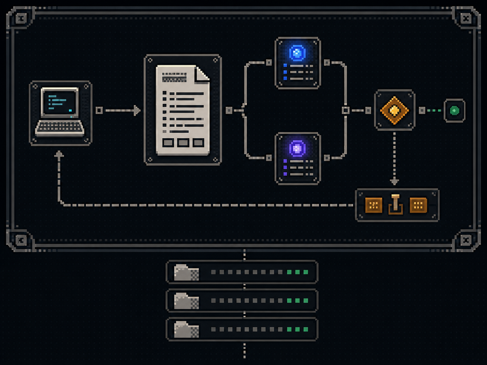
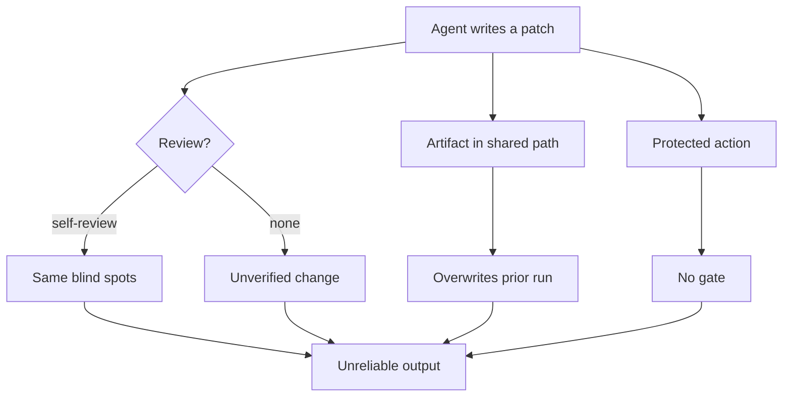
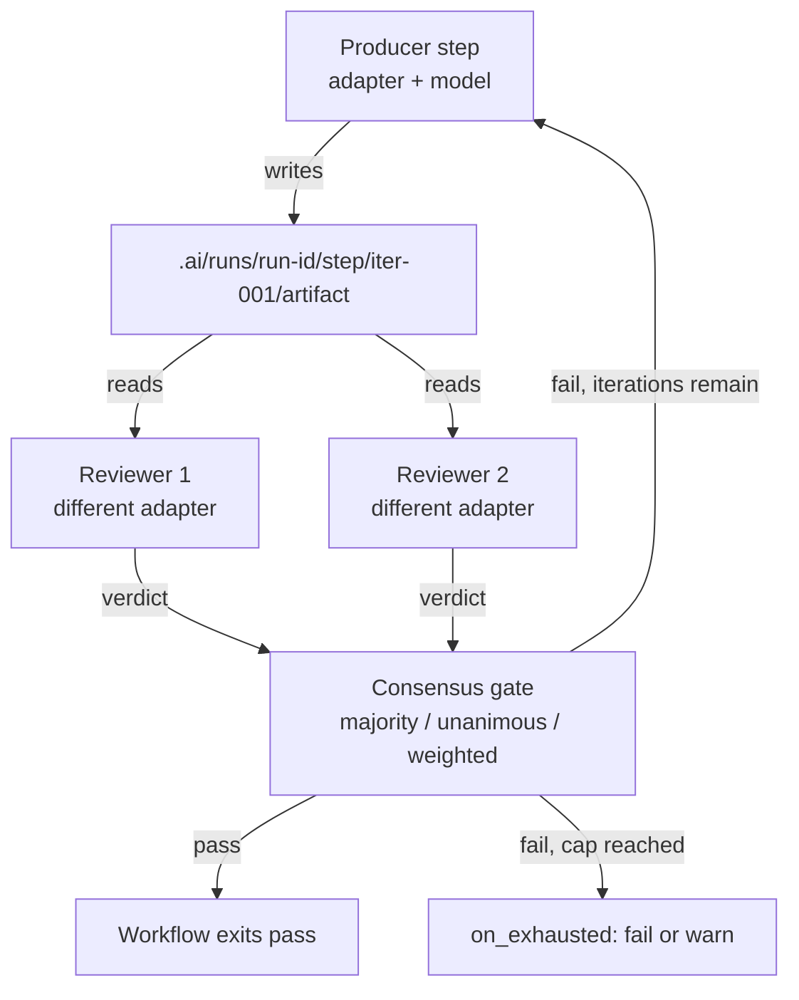
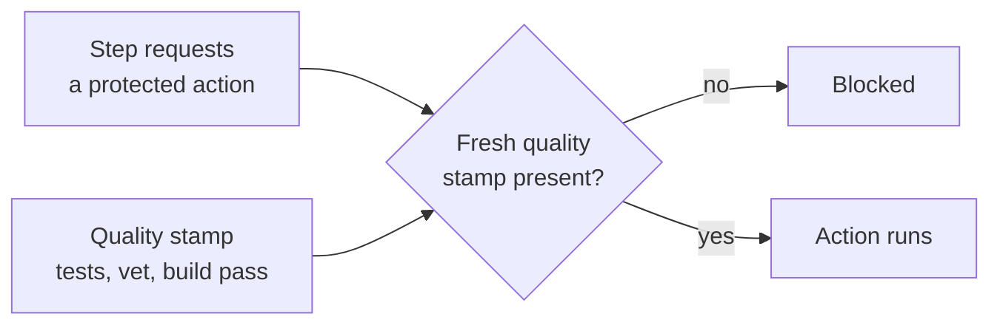

# Mivia AgentKit: Bounding the Work Between a Patch and a Merge



The work between a patch and a safe merge is where failures live: unbounded turns, a model reviewing its own output, artifacts that overwrite each other, and protected actions with no gate.

Mivia AgentKit is a local Go binary that fixes the workflow around the agent, not the agent itself. It wraps existing headless CLIs behind a bounded produce-review loop with rule-based consensus and hard gates. It bounds what they do.

## The failure mode is the workflow



A model reviewing its own output has the same blind spots it had when writing it. An artifact written to a shared path silently destroys the previous attempt.

## What AgentKit is

A single local binary. Not a hosted service. Not a framework. Not another agent.

It bounds the work in four ways: produce-review loops with iteration caps; a reviewer from a different model family than the producer; gates on commit, push, pull request, deploy, release, and live-smoke that require a fresh quality stamp; and per-run artifact isolation under `.ai/runs/<run-id>/`, so nothing overwrites.

Adding a new CLI is one adapter file because AgentKit never calls the model APIs itself. The wrapped CLI does.

## The adapter model

Every CLI implements the same contract. An adapter implements `Detect`, `Run`, and `Review`. `Detect` checks the binary exists and is headless-capable. `Run` invokes it non-interactively. `Review` appends a structured-verdict instruction and parses the result. The orchestrator above the adapter never knows which CLI ran.

The supported surface today:

| CLI | Binary | Role | Headless invocation |
|---|---|---|---|
| Codex | `codex` | orchestrable | `codex exec --json` |
| Claude Code | `claude` | orchestrable | `claude -p --output-format json` |
| ZAI (Z.ai GLM) | `zai` | orchestrable | `zai -m <model> -p <prompt> --no-color` |
| Crush | `crush` | orchestrable | `crush run --quiet` |
| Antigravity | `agy` | orchestrable | `agy` noninteractive run |
| GitHub Copilot | - | guidance | not an orchestrated runtime |

## The produce-review loop

A producer step writes an artifact. A reviewer step reads it and returns a JSON verdict. A consensus gate decides pass, iterate, or fail.



The reviewer runs under a different adapter than the producer. Two model families must pass before the artifact is accepted, so a blind spot one family has cannot ship the artifact.

Each retry writes a new iteration directory: `iter-001`, `iter-002`, `iter-003`. A failed review feeds its notes into the next producer run. Nothing is overwritten, and every attempt is inspectable after the fact.

The default consensus mode is `majority`; the engine also supports `unanimous`, `weighted`, and `first-pass` for less common cases. For consequential work, use `majority` with `min_reviewers: 2` and two reviewers from different adapters - the strongest default.

## A real example

A read-only research loop. ZAI produces notes, Codex reviews them.

```yaml
# .ai/workflows/research-loop.yaml
version: 1
name: research-loop
bound: iterations
max_iterations: 3
steps:
  - id: research
    producer: zai
    artifact: research.md
  - id: review
    reviewers:
      - codex
    artifact: research.md
    consensus:
      mode: majority
      min_reviewers: 1
      tie_breaker: strict
    on_fail: iterate
exit_when: review-pass
on_exhausted: warn
```

Run it:

```bash
mivia-agent run --repo /path/to/repo \
  --workflow research-loop \
  --var objective="map every call site of the auth timeout" \
  --json
```

The output names the run directory and the artifact path directly - the trace ID is the directory name, and the `RunDir` field gives you the absolute path to the evidence.

## When the work must write

Research is read-only. Implementation is not. A write workflow marks the producer step with `approval: protect:commit`:

```yaml
# .ai/workflows/implementation-loop.yaml
version: 1
name: implementation-loop
bound: iterations
max_iterations: 2
steps:
  - id: implement
    producer: zai
    artifact: patch.md
    approval: protect:commit   # protected action - triggers the gate below
    max_turns: 12
    timeout: 15m
  - id: review
    reviewers:
      - codex
      - zai                     # cross-model: two families must agree
    artifact: patch.md
    consensus:
      mode: majority
      min_reviewers: 2
      tie_breaker: strict
    on_fail: iterate
exit_when: review-pass
on_exhausted: fail
```

The `protect:` prefix is what makes a step protected. A bare `approval: commit` is treated as a plain approval string and does not trigger the gate. Protected-bound loops default to `on_exhausted: fail`: an exhausted write attempt that never passed review should not ship.

## Protected actions and hard controls

AgentKit gates protected actions with a fresh quality stamp written by `mivia-agent preflight`. The stamp proves the configured verifiers passed on the current diff. No stamp, no protected action, regardless of what the model decides.



Commit, push, pull request, deploy, release, and live-smoke are protected actions. A step becomes protected when its approval carries the `protect:` prefix. Before any protected step runs, AgentKit checks for the stamp. This is the enforcement layer for the principle the [working contract article](../engineering-working-contracts/README.md) argues: instructions are guidance, but protected actions need a hard control.

## What it does not do

AgentKit does not guarantee correct code. The model still does the work; AgentKit bounds it. A bad producer still produces a bad artifact. The value is that a different model family must independently pass it, a protected action cannot run without proof, and every attempt is isolated rather than silently overwritten. Two models can still share a blind spot, so a passing verdict is agreement on the review, not proof of correctness.

Adapter coverage varies by CLI. ZAI has no reasoning-effort flag. Crush takes its prompt on stdin. Antigravity is invoked one-shot with `agy -p`. The adapter validates what its CLI actually supports and rejects the rest before invocation, so a workflow never hands a flag to a CLI that will ignore or misinterpret it.

The binary, source, and workflow examples are in the [MiviaLabs/mivia-agentkit](https://github.com/MiviaLabs/mivia-agentkit) repository.
