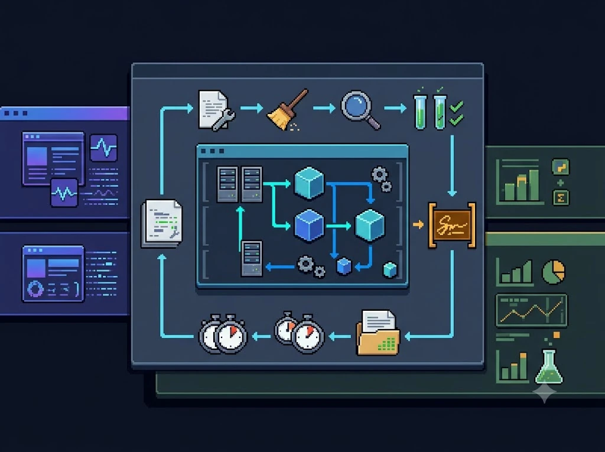
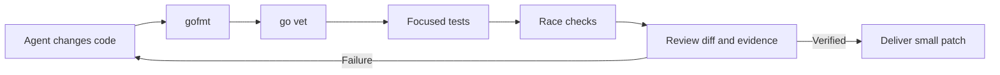
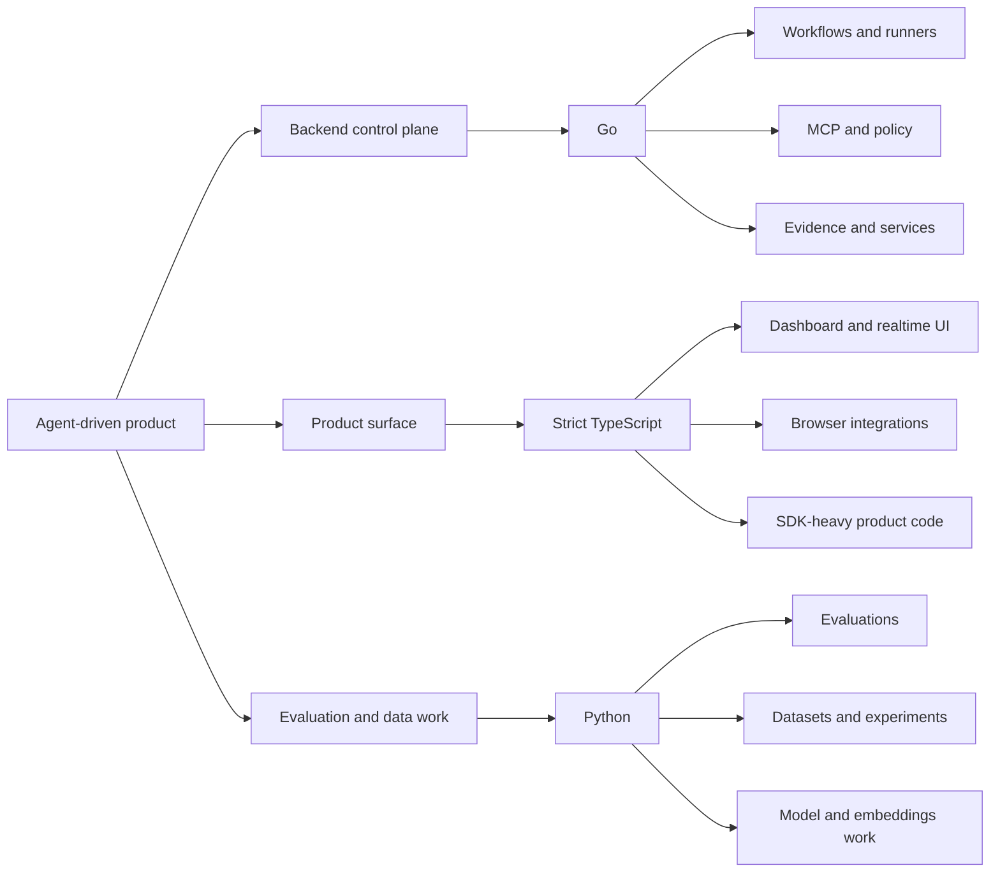

# I Didn't Switch to Go Because of Agents



*Why I moved my backend from Node.js to Go for agent-driven systems.*

I used Node.js for backend work because it was productive and close to the JavaScript ecosystem around the products I was building.

I chose Go for the backend of my agent-driven systems for a different reason. I have been working with Go since 2017, so this was not a learning experiment or a reaction to the latest agent trend. I already knew how to build and operate services with it.

Agents changed the decision by making the correction loop more important. In my repositories, generated changes need to be inspected, tested, repaired, and verified repeatedly. That makes a backend whose conventions and failure paths stay easy to see more valuable to me.

## The backend changed before the language did

The systems I am building around agents are not just request-response web applications. They include:

- long-running services;
- orchestration and workflow execution;
- concurrent workers and runners;
- policy enforcement;
- evidence collection;
- repository operations;
- state transitions that must be visible and recoverable.

That is a control plane. It needs lifecycle boundaries and operational behavior that an engineer or an agent can inspect without reconstructing a large framework's hidden rules.

Node.js remains an excellent choice for many products. Node.js is the runtime; TypeScript is a language and toolchain commonly used with it. My comparison is really between a Go backend and a Node.js/TypeScript backend stack.

I still reach for that stack when the work is close to the browser, depends on a high-level AI SDK, needs realtime product integration, or benefits from sharing types across a web application. My change is narrower: Go is now my default for the control plane.

## Agents made the repair loop the main constraint

When I write a service myself, I can carry a lot of design context in my head. When an agent writes or repairs it, the repository and its checks have to carry more of that context.

The useful question is not only, "How quickly can the first version be generated?" It is also, "How clearly can the next failure be exposed, localized, and repaired?"



Go gives me a compact, conventional loop:

```text
test -z "$(gofmt -l .)"
go vet ./...
go test ./...
go test -race ./...
```

That loop is not a proof that the code is correct. The race detector only observes races on executed paths, and tests can miss requirements or incorrect business logic. The value is that the feedback is concrete and repeatable. An agent can run it, see what failed, and make a smaller next change.

I use the race-enabled check when a change touches concurrent code or lifecycle behavior. The [Go command documentation](https://go.dev/doc/cmd) and [race detector documentation](https://go.dev/doc/articles/race_detector) make those checks easy to standardize. In practice, Go gives me the combination I care about here: standardized formatting, visible error handling, conventional package structure, and a toolchain that produces concrete feedback.

## Why Go fits this kind of code

### A small language surface reduces invention

Agents are good at producing plausible variations. That is useful when exploring a problem, but it increases review cost when a repository has several competing ways to express the same thing.

I find Go gives my repositories fewer ways to express the same backend behavior. Packages, interfaces, errors, tests, and formatting follow strong conventions. That reduces the amount of local convention an agent has to infer. It does not prevent abstraction mistakes, hidden coupling, ignored errors, or incorrect requirements.

### Explicit errors keep failure paths visible

Agent-built systems fail at boundaries: a tool call times out, a workflow is cancelled, a subprocess exits, a dependency returns malformed data, or a policy check rejects an action.

I want those failures to stay visible in the call graph. In ordinary Go code, failures are commonly returned as `error` values, which gives me a visible place to handle them. Go does not force callers to handle every error, so the contract and review still matter.

### Concurrency is part of the model

Agent runtimes often have concurrent work: tool calls, streaming events, subprocesses, workers, timers, and cancellation. Go's standard concurrency model is not automatically safe, but it is direct enough to make ownership, context propagation, shutdown, and synchronization explicit.

That matters more than raw throughput. The goal is not to add goroutines everywhere. The goal is to make the lifetime of every goroutine understandable, bounded, and testable.

Go also makes it easy to create concurrency bugs. Goroutine leaks, unclear ownership, cancellation races, and shared-state mistakes remain real risks. Node.js has different tradeoffs rather than no concurrency model: its event loop simplifies some coordination, while workers and asynchronous cancellation introduce their own boundaries.

### The deployment boundary is straightforward

For long-running backend services, I prefer Go's small operational surface: ordinary packages, a clear entry point, a standard toolchain, and a compiled artifact. That matches the services I want agents to modify and makes the build boundary easier for me to inspect and reproduce.

Node.js can be equally reproducible with a locked dependency graph, a pinned runtime, and a disciplined container build. My preference is operational, not a claim that Node.js deployment is inherently fragile.

## TypeScript is still the closest alternative

I am not dismissing TypeScript. In many AI products, it is the better choice.

The [OpenAI Agents SDK](https://openai.github.io/openai-agents-js/) has strong TypeScript and Python support, and the [Anthropic Agent SDK documentation](https://code.claude.com/docs/en/agent-sdk/quickstart) also centers those languages. Anthropic's current [general client SDK documentation](https://platform.claude.com/docs/en/cli-sdks-libraries/overview) lists Go alongside Python, TypeScript, C#, Java, PHP, and Ruby. If the main job is connecting agent capabilities to a web product, TypeScript often removes integration work.

GitHub's [2025 Octoverse report](https://github.blog/news-insights/octoverse/octoverse-a-new-developer-joins-github-every-second-as-ai-leads-typescript-to-1/) reported that TypeScript ranked first in August 2025 by distinct monthly contributors who committed code in that language. That is a GitHub-specific usage measure, not a universal ranking. I take it as a signal of ecosystem activity, not evidence that TypeScript is the best backend language for every system.

When I use TypeScript for agent-facing product surfaces, I treat the type system as a required boundary, not a decoration. I enable strict checking, add `noUncheckedIndexedAccess`, validate external data at runtime, and reject unreviewed escapes such as `any`, unnecessary assertions, and unjustified `@ts-ignore`.

TypeScript can be a reliable choice for me when the repository enforces those rules. Without them, an agent can produce code that looks typed while allowing uncertainty to leak through the most important boundaries.

That rule is also consistent with recent research. A [2026 study of filtered TypeScript pull requests](https://arxiv.org/abs/2602.17955) found that agent-authored changes added `any` roughly nine times more often than human changes, along with more type assertions. I do not treat that as a universal rate, but it reinforces the boundary I already use: strict compiler settings and runtime validation are mandatory.

Go also costs me things. Some high-level agent SDKs and integrations arrive first in Python or TypeScript, and using Go can mean working closer to HTTP, JSON schemas, streaming protocols, or MCP primitives. If the product is primarily an SDK integration or browser-facing application, TypeScript may deliver faster and with less glue code. My choice is worth that cost because the control plane is the part I expect to run for a long time and repair repeatedly.

## What the benchmarks do and do not say

The [Multi-SWE-bench paper](https://arxiv.org/abs/2504.02605) is useful because it evaluates issue resolution across seven languages instead of treating Python as a proxy for all software repositories. Its dataset includes 1,632 tasks across Java, TypeScript, JavaScript, Go, Rust, C, and C++.

The benchmark makes cross-language issue-resolution comparisons possible. Its results vary across repositories, tasks, models, and repair methods. It does not isolate language as the cause, and it does not prove that Go produces fewer bugs. I use it as context, not as proof for my decision.

## The split I use for Mivia

I am not trying to force one language across the entire product. I assign each language to the boundary where it gives me the best tradeoff.



For Mivia, that means:

- **Go:** control plane, workflows and activities, runner and harness code, MCP server, policy enforcement, evidence collection, repository operations, and long-running services.
- **TypeScript:** dashboard, realtime UI, browser-facing integrations, and product surfaces where the JavaScript ecosystem materially reduces work.
- **Python:** isolated evaluation pipelines, dataset processing, model experiments, embeddings research, and training utilities.

The boundary is intentional. It keeps the backend optimized for predictable execution while allowing the product and research layers to use the ecosystems that are strongest for them.

## What I require from agents working in Go

Choosing Go does not remove the need for engineering discipline. It makes the discipline easier to encode.

For agent-produced Go changes, I want:

- formatting checked before review;
- `go vet` and focused tests run before a completion claim;
- race-enabled tests for concurrent code;
- explicit context propagation and cancellation;
- bounded goroutine lifetimes;
- small package-level changes;
- interfaces that are narrow enough to test without reflection-heavy frameworks;
- evidence showing what actually ran and what remains unverified.

Those rules address the failure modes that language choice cannot solve. Research on LLM-agent bug reports found logic bugs in 22.7% of Stack Overflow cases and 30.2% of GitHub cases in its annotated corpus. I read that as a reminder that language choice cannot replace precise requirements, repository-level tests, independent verification, and evidence of what actually ran.

## The decision

I chose Go because it fits the backend I am building and because I already knew the language well enough to use it without paying a learning tax.

Agents did not create that preference. They made its practical value more visible: a smaller path from generated code to a verified change.

Node.js, TypeScript, and Python still have clear roles. This is not a language ranking for every project. It is the boundary that works for the systems I am building.

## Sources

- [Go command documentation](https://go.dev/doc/cmd) and [Effective Go](https://go.dev/doc/effective_go) for current tool references and package, formatting, and error-handling conventions.
- [Go data race detector](https://go.dev/doc/articles/race_detector) for the limits and usage of `go test -race`.
- [MCP SDK support table](https://modelcontextprotocol.io/docs/sdk) and the [official MCP Go SDK](https://github.com/modelcontextprotocol/go-sdk) for Go support in the MCP ecosystem.
- [OpenAI Agents SDK for TypeScript](https://openai.github.io/openai-agents-js/) and [OpenAI Agents SDK for Python](https://openai.github.io/openai-agents-python/) for current high-level SDK coverage.
- [Anthropic client SDKs](https://platform.claude.com/docs/en/cli-sdks-libraries/overview) for current language and runtime coverage.
- [GitHub Octoverse 2025](https://github.blog/news-insights/octoverse/octoverse-a-new-developer-joins-github-every-second-as-ai-leads-typescript-to-1/) for the TypeScript ecosystem signal.
- [Empirical study of agent-generated TypeScript](https://arxiv.org/abs/2602.17955) for the observed increase in `any` and assertion usage.
- [Multi-SWE-bench](https://arxiv.org/abs/2504.02605) for multilingual issue-resolution evaluation and its limitations.
- [Analysis of bugs in LLM agent systems](https://arxiv.org/abs/2601.15232) for the qualified logic-bug corpus findings.
