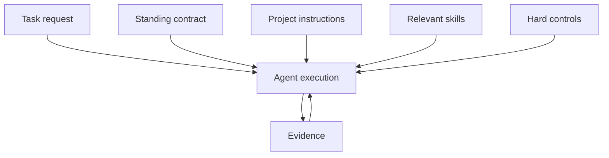

# Operating Model

The original working contract started as one large set of instructions. That format is useful for experimentation, but it is not the right final architecture.

Different rules have different scopes and enforcement needs.

## Layers

| Layer | Purpose | Examples |
|---|---|---|
| Standing contract | Judgment that should apply across engineering work | evidence discipline, autonomy, implementation principles, verification claims |
| Project instructions | Repository-specific facts and commands | architecture, test commands, dependency policy, definition of done |
| Skills | Procedures that should load only when relevant | verify a code change, run a deep bug audit, assess agent-action readiness, review a migration |
| Hard controls | Boundaries that must not depend on model memory | permissions, hooks, sandboxing, required checks, secret scanning |
| Task request | The concrete outcome and constraints | issue, feature request, acceptance criteria, selected files |

## Why the separation matters

A large global file loads procedures that are irrelevant to most tasks. It also makes contradictions and stale guidance harder to detect.

A standing contract should remain compact. It should change agent judgment, not describe every workflow.

A skill should solve one repeatable job. It should define when it applies, what inputs it needs, what steps to follow, what output to produce, and how to handle failure.

A hard boundary should be enforced outside the prompt whenever possible.

## How users should apply the system

### Personal setup

Install the standing contract globally and install the skills globally. Every repository inherits the same operating expectations, while each repository adds its own commands and constraints.

### Team repository

Check project instructions into the repository. Add only the skills that are relevant to that codebase. Keep destructive operations and required checks in permissions, hooks, or CI.

### Desktop applications

Use the plugin package in Codex Desktop. Use ZIP skill packages in Claude Desktop and Cowork. Desktop skill installation provides reusable workflows, but it does not replace repository-specific instructions.

## What this system does not solve

- unclear product requirements;
- missing architecture decisions;
- insufficient test environments;
- weak permissions or sandboxing;
- human approval for consequential decisions;
- model limitations;
- malicious or compromised third-party skills.

The system reduces avoidable workflow failures. It does not remove the need for engineering judgment.
